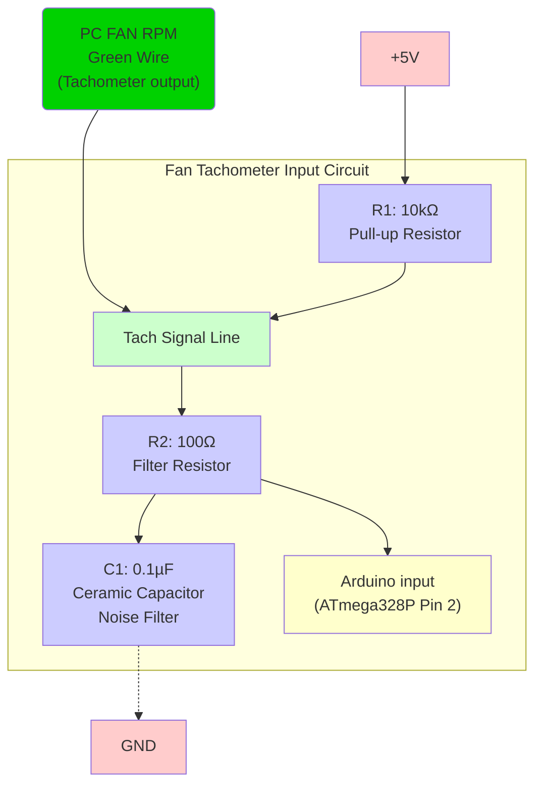
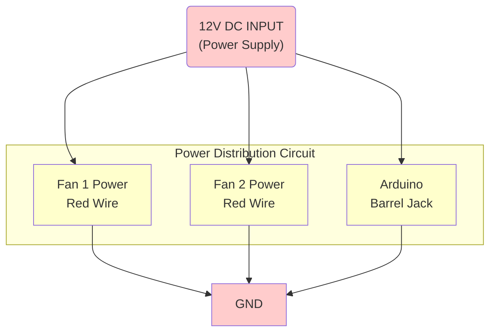

# Dual-Fan-Controller
Created for the purpose of syncing the RPM speeds of the Sycthe Flex II and Flex II slim models on an arduino. 
This gets rid of a weird noise frequency when both fans are stacked near each other. 

An Arduino Uno R3 was used for this project

PWM signal is directly connected to the pins. 

A pontimeter is hooked up to A0 input for RPM controller

Additional components were used on RPM signal to help get rid of noise:

Component lay used to filter noise, each RPM signal uses the following inpuit:

a 12v power supply with a 5.5x2.1 barrel jack is used,  is used and split out to power each item:
PC fans use a DC power to PC fan adapter, a Y cable splits that out to both fans. Fans are connected with jumper cables

4-Pin PWM PC fans use the following pin outs, and generally use these colors:
Pin 1: GND ( black )
Pin 2: PWR ( yellow )
Pin 3: RPM ( Green )
Pin 4: PWM ( Blue )

In the case of all black wires, Pin 1, GND, is often stripped in gray. The PC fan connector has the notch directly on the edge connector as well for the gnd pin as, 4pin connectors are 3pin compatible the other notch is offset and not flush with the edge of the connector. 

